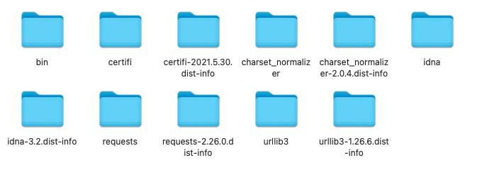
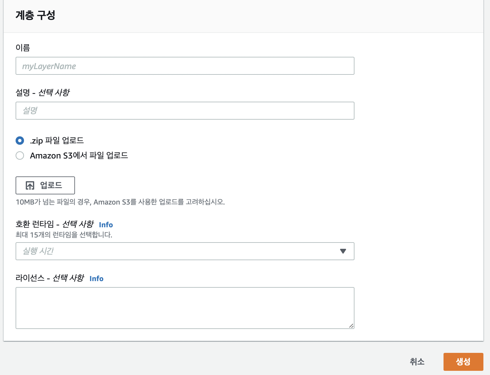
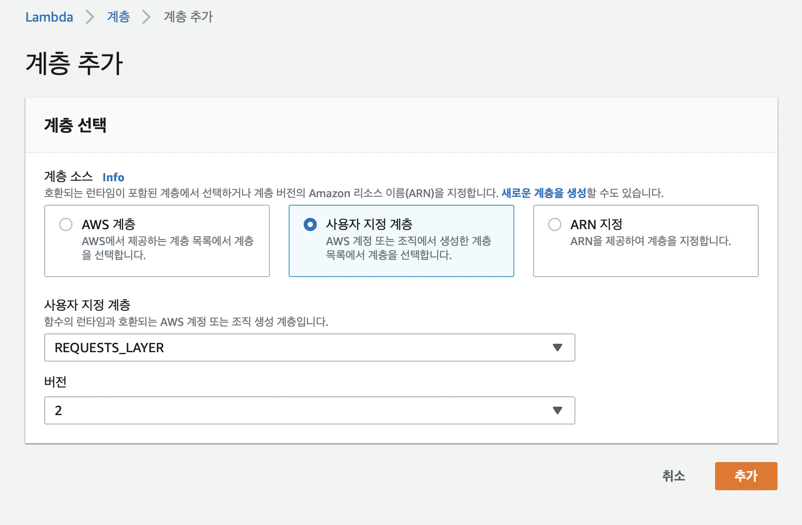

## AWS Lambda에 파이썬 외부 라이브러리 사용하기
Serverless로 코드를 실행할 수 있는 AWS Lambda에는 Layer라는 기능이 있다.  
Layer는 외부 라이브러리를 쉽게 사용할 수 있도록 해주는 도구인데, 2018년 말 즈음에 추가가 되었다고 한다.  

이번엔 수 많은 Lambda 런타임 중에 파이썬 라이브러리를 Lambda Layer에 어떻게 올리는지 정리했다.  

### PIP로 필요한 라이브러리 받기
> pip install [설치할 모듈] -t [설치할 디렉토리]

-t옵션을 추가하고 디렉토리를 설정하면 명령어로 [설치할 디렉토리]에 [설치할 모듈]의 파일들을 받을 수 있다.  

이번엔 파이썬 requests 모듈을 받아보겠다.  

> pip install requests -t .

.은 현재 디렉토리에 설치하라는 뜻.  

그렇게 되면 해당 디렉토리에 패키지 파일들이 받아져 있는걸 확인 할 수 있다.

그리고 이 파일들을 python이라는 폴더 안에 넣어야한다. 만약 다른 이름으로 되어있으면 Lambda가 인식을 못한다.🥲

  
👆요렇게

이렇게 만든 폴더를 .zip으로 압축한다!

### AWS Lambda에서 Layer추가하기

그리고 AWS Lambda에 접속해 '계층'이라는 페이지로 이동한 후, '계층생성'버튼을 누른다.  

그럼 이런 창이 나올텐데, 이름과 설명은 알아서 작성 하고, .zip파일 업로드를 클릭해서 아까 압축한 zip파일을 업로드 한다.  
그리고 사용할 파이썬 버전(런타임)을 선택하고 생성 버튼을 누르면 된다.  

### Lambda 함수에서 생성한 Layer 넣기

Layer가 잘 생성 되었다면, 사용하고자 하는 함수 안에 Add a layer를 누르면 Layer를 추가할 수 있다.

그러면 '사용자 지정 계층'에서 사용하고자 하는 계층을 선택하고, 버전은 처음 생성한 Layer라면 "1"이 있을텐데 1까지 선택해준 후에 추가를 눌러주면 해당 함수에서 외부 패키지를 사용할 수 있다! 👏